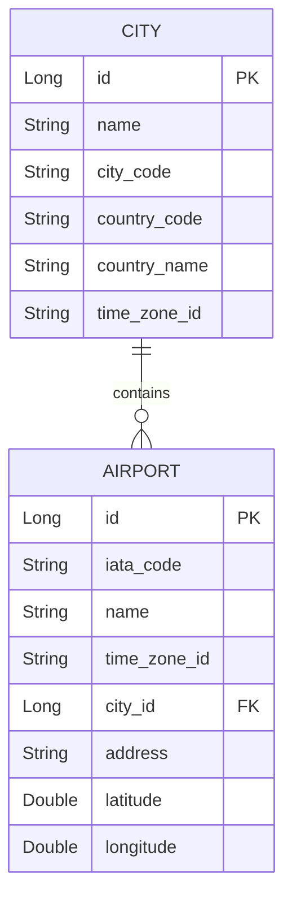
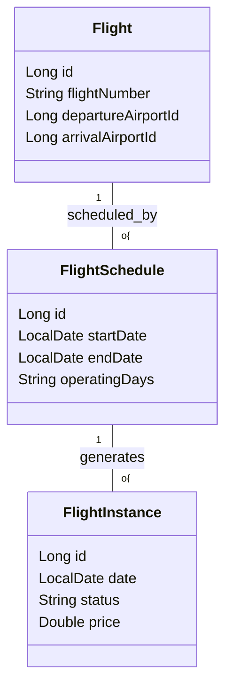

# Master Spring Boot Microservices: Airline Booking System Course Notes

This document contains comprehensive development steps, system design patterns, and core backend engineering theory from the **11-Hour Airline Booking Microservices Course**. It is structured for easy reading and copy-pasting directly into Google Drive.

---

## TABLE OF CONTENTS
1. **Course Introduction & Live System Demo**
2. **Monolithic vs. Microservices Architecture**
3. **Microservices Communication: REST vs. Event-Driven**
4. **Project Structure: Maven Multi-Module Architecture**
5. **Step-by-Step Setup: Root Parent & Shared Common Library**
6. **Step-by-Step Setup: Location Microservice (Cities & Airports)**
7. **Step-by-Step Setup: User & Authentication Microservice (JWT & Security)**
8. **Step-by-Step Setup: Airline Core Microservice (Aircraft & Cabin Maps)**
9. **Step-by-Step Setup: Flight Operation Microservice (Schedules & Instances)**
10. **Postman API Integration Testing & Troubleshooting**

---

## 1. Course Introduction & Live System Demo

### 1.1 Course Objective
The goal is to move from basic CRUD applications toward **distributed systems engineering**. We build a production-grade distributed backend system inspired by real-world airline reservation systems.

### 1.2 Technology Stack
*   **Core Backend**: Java 17, Spring Boot 3.x
*   **Microservices Ecosystem**: Spring Cloud, Eureka Service Registry, Spring Cloud Gateway, OpenFeign, Resilience4j
*   **Database & Caching**: MySQL / Oracle Database, Spring Data JPA, Redis Caching
*   **Event Streaming**: Apache Kafka
*   **Security**: Spring Security, JWT (JSON Web Tokens), BCrypt Password Hashing
*   **Infrastructure**: Docker, Maven Multi-Module build
*   **Testing**: Postman, JUnit 5, Mockito

### 1.3 Key Business Features & User Roles
1.  **Search & Filtering**: Search flights by origin, destination, date, cabin class, fare type, and passenger count. Filters: airlines, departure/arrival times, max duration.
2.  **Seat Selection**: Interactive seat map (Window, Middle, Aisle) preventing double-booking.
3.  **Ancillaries & Add-ons**: Secure Trip insurance, meals (vegetarian, kids, etc.), extra check-in baggage.
4.  **Booking Flow**: Dynamic price breakdown, passenger details, contact info.
5.  **Payment Integration**: Generates payment links, redirects to secure checkout, handles webhook status.
6.  **Ticket Generation & Notifications**: Ticket generated as a downloadable PDF and sent via email upon booking confirmation.
7.  **Admin Dashboards**:
    *   **Airline Admin**: Manages aircraft, flights, fare rules, baggage policies, schedules, and views real-time cabin maps.
    *   **System Admin**: Manages airports, cities, airlines, and handles access control (e.g., suspending or activating airlines).

---

## 2. Monolithic vs. Microservices Architecture

### 2.1 The "Airline City" Analogy
*   **Monolithic Building**: Imagine a city with only one giant building doing everything—booking, payments, users, and notifications.
*   **Microservices Buildings**: The city is divided into separate, specialized buildings (Booking Building, Payment Building, User Building). Each performs a single job and operates independently.

### 2.2 Monolithic Architecture Limitations
1.  **Scaling Inefficiency**: In a monolith, you cannot scale a single component. If flight search receives 90% of the traffic but payment receives 5%, you must replicate the entire monolith, wasting CPU and memory resources.
2.  **Deployment Overhead**: A single line change in the payment module requires rebuilding and redeploying the entire application. The entire platform goes down and restarts.
3.  **Tight Coupling & Fault Propagation**: If the payment service crashes (e.g., due to an out-of-memory error), the entire application crashes, making it impossible to even browse flights.

### 2.3 Microservices Core Principles
*   **Single Responsibility**: A microservice does one specific job and does it well (e.g., Booking service manages bookings).
*   **Independent Deployment**: Updating or fixing the User service does not touch or require redeploying the Payment service.
*   **Loose Coupling**: Services talk to each other through defined APIs but do not know or rely on each other's internal implementation details.
*   **Database per Service**: Every microservice owns its data store. Sharing a database violates encapsulation and leads to tight coupling.

| Principle | Monolithic Approach | Microservices Approach |
| :--- | :--- | :--- |
| **Codebase** | Single large repository | Single parent repository with separate modules |
| **Deployment** | Single artifact (WAR/JAR) | Multiple individual artifacts (JARs/Docker images) |
| **Scaling** | Scale horizontally as a whole unit | Scale individual services (e.g., search gets 5 instances, payment 1) |
| **Fault Tolerance** | Single point of failure | Isolated failures (if payment is down, search still works) |
| **Data Model** | Shared database | Private database per service |

---

## 3. Microservices Communication: REST vs. Event-Driven

Services must interact to complete complex business flows (e.g., Booking needs to check user status and trigger payment).

### 3.1 Synchronous Communication (REST & OpenFeign)
*   **Analogy**: A phone call. Service A calls Service B, waits on the line, and gets a response.
*   **Usage**: When immediate response is mandatory (e.g., checking seat availability during checkout).
*   **Implementation**: Java developers use **Spring Cloud OpenFeign** instead of the legacy `RestTemplate`. It allows writing interface-driven HTTP clients with declarative annotations.
*   **Risk**: Cascading failures. If Service B is slow or down, Service A hangs, consuming thread pool resources.

### 3.2 Asynchronous Communication (Event-Driven & Kafka)
*   **Analogy**: Text message/Email. Service A broadcasts a message to a queue and immediately goes back to other tasks. Service B processes it when ready.
*   **Usage**: Post-booking workflows (e.g., sending booking confirmation emails, updating loyalty points, generating analytics).
*   **Implementation**: Apache Kafka serves as the central message broker.
*   **Benefits**: High throughput, loose coupling, resilience (if the email service is down, Kafka stores the message until it recovers).

---

## 4. Project Structure: Maven Multi-Module Architecture

### 4.1 The Need for Multi-Module Setup
If an enterprise system consists of 10+ microservices, opening 10 separate IDE projects is highly inefficient.
*   **The Solution**: Maven Multi-Module structure. Keep all services inside a single master repository, allowing developers to build the entire system with one build command (`mvn clean install`).
*   **Version Consistency**: Shared versions are declared in the parent POM, preventing dependency drift where different services use conflicting Spring Boot versions.

### 4.2 Module Organization
*   **Parent POM**: The "CEO" of the project. Manages global versions, plugins, and configurations.
*   **Cloud Aggregator**: Manages infrastructure services (Eureka Service Registry, API Gateway, Config Server).
*   **Services Aggregator**: Manages core business microservices (Location, User, Airline Core, Flight Operation, Booking, Payment).
*   **Common Library (`common-lib`)**: A shared jar module containing shared DTOs, Enums, global exceptions, and utility classes.

```text
josh-airline-microservices (Root Project)
│
├── pom.xml (Parent POM)
│
├── common-lib/ (Shared Jar Library)
│   └── pom.xml
│
├── cloud-infrastructure/ (Aggregator Module)
│   ├── pom.xml
│   ├── service-registry/ (Eureka Server)
│   ├── api-gateway/
│   └── config-server/
│
└── services/ (Aggregator Module)
    ├── pom.xml
    ├── location-service/
    ├── user-service/
    ├── airline-service/
    └── flight-operation-service/
```

---

## 5. Step-by-Step Setup: Root Parent & Shared Common Library

### Step 5.1: Create Parent POM
In the root directory, create a `pom.xml` with packaging type `pom`. Declare the global properties and dependency management.

```xml
<project xmlns="http://maven.apache.org/POM/4.0.0" 
         xmlns:xsi="http://www.w3.org/2001/XMLSchema-instance"
         xsi:schemaLocation="http://maven.apache.org/POM/4.0.0 http://maven.apache.org/xsd/maven-4.0.0.xsd">
    <modelVersion>4.0.0</modelVersion>
    <groupId>com.josh</groupId>
    <artifactId>airline-parent</artifactId>
    <version>0.0.1-SNAPSHOT</version>
    <packaging>pom</packaging>
    
    <properties>
        <java.version>17</java.version>
        <spring-boot.version>3.2.4</spring-boot.version>
        <spring-cloud.version>2023.0.0</spring-cloud.version>
    </properties>

    <modules>
        <module>common-lib</module>
        <module>services</module>
    </modules>
</project>
```

### Step 5.2: Set Up Services Aggregator POM
Inside the `services` directory, create a `pom.xml` with packaging type `pom` to manage the business microservices:
```xml
<parent>
    <groupId>com.josh</groupId>
    <artifactId>airline-parent</artifactId>
    <version>0.0.1-SNAPSHOT</version>
    <relativePath>../pom.xml</relativePath>
</parent>
<artifactId>services</artifactId>
<packaging>pom</packaging>

<modules>
    <module>location-service</module>
    <module>user-service</module>
    <module>airline-service</module>
    <module>flight-operation-service</module>
</modules>
```

### Step 5.3: Set Up Common Library (`common-lib`)
Create the `common-lib` directory. It outputs a reusable jar file and does **not** contain a Spring Boot main execution class.
*   **Lombok Configuration**: Mark Lombok as `<optional>true</optional>` in the library pom so it doesn't transitively infect runtime environments of client services.
*   **Jakarta Persistence**: Include as an optional dependency so services not interacting with JPA can exclude it.

`common-lib/pom.xml`:
```xml
<parent>
    <groupId>com.josh</groupId>
    <artifactId>airline-parent</artifactId>
    <version>0.0.1-SNAPSHOT</version>
    <relativePath>../pom.xml</relativePath>
</parent>
<artifactId>common-lib</artifactId>
<packaging>jar</packaging>

<dependencies>
    <!-- Lombok (Compile-only helper) -->
    <dependency>
        <groupId>org.projectlombok</groupId>
        <artifactId>lombok</artifactId>
        <version>1.18.30</version>
        <optional>true</optional>
    </dependency>
    <!-- Validation API -->
    <dependency>
        <groupId>org.springframework.boot</groupId>
        <artifactId>spring-boot-starter-validation</artifactId>
        <version>3.2.4</version>
    </dependency>
    <!-- Optional Jakarta Persistence -->
    <dependency>
        <groupId>jakarta.persistence</groupId>
        <artifactId>jakarta.persistence-api</artifactId>
        <version>3.1.0</version>
        <optional>true</optional>
    </dependency>
    <!-- Optional Jackson for JSON payloads -->
    <dependency>
        <groupId>com.fasterxml.jackson.core</groupId>
        <artifactId>jackson-annotations</artifactId>
        <version>2.15.4</version>
        <optional>true</optional>
    </dependency>
</dependencies>
```

---

## 6. Step-by-Step Setup: Location Microservice (Cities & Airports)

The **Location Service** manages geographical reference data (Cities and Airports).

### 6.1 Database Schema Design
*   **City Table**: Stores basic city profiles.
*   **Airport Table**: Map to one specific City.



### 6.2 Implementation Steps

#### Step 1: Create spring-boot configuration `application.yml`
Configure connection strings, port `5001`, and register with Eureka discovery client.
```yaml
server:
  port: 5001

spring:
  application:
    name: location-service
  datasource:
    url: jdbc:mysql://localhost:3306/airline_location_db?useSSL=false&serverTimezone=UTC
    username: root
    password: password
  jpa:
    hibernate:
      ddl-auto: update
    show-sql: true

eureka:
  client:
    service-url:
      defaultZone: http://localhost:8761/eureka/
```

#### Step 2: Define JPA Entities
`City.java`:
```java
@Entity
@Table(name = "CITIES")
@Getter @Setter @NoArgsConstructor @AllArgsConstructor
public class City {
    @Id
    @GeneratedValue(strategy = GenerationType.IDENTITY)
    private Long id;
    
    @NotBlank(message = "City name is required")
    private String name;
    
    @Column(unique = true)
    private String cityCode;
    
    private String countryCode;
    private String countryName;
    private String timeZoneId;
}
```

`Airport.java`:
```java
@Entity
@Table(name = "AIRPORTS")
@Getter @Setter @NoArgsConstructor @AllArgsConstructor
public class Airport {
    @Id
    @GeneratedValue(strategy = GenerationType.IDENTITY)
    private Long id;
    
    @Column(unique = true)
    private String iataCode;
    
    private String name;
    private String timeZoneId;
    
    @ManyToOne(fetch = FetchType.LAZY)
    @JoinColumn(name = "city_id", nullable = false)
    private City city;
    
    private String address;
    private Double latitude;
    private Double longitude;
}
```

#### Step 3: DTOs & Mappers
We do not expose JPA entities directly to protect DB schemas and prevent infinite recursive serialization. Use `CityResponseDTO`.
```java
@Getter @Setter
public class CityResponseDTO {
    private Long id;
    private String name;
    private String cityCode;
    private String countryName;
    private String timeZoneId;
}
```
*Create manual mappers or use MapStruct to map `Entity <-> DTO`.*

#### Step 4: Repository Interfaces
```java
@Repository
public interface CityRepository extends JpaRepository<City, Long> {
    Optional<City> findByCityCode(String cityCode);
}
```

#### Step 5: Service Implementation with Redis Caching
Cities and Airports are reference data (read-heavy, write-rarely). Cache them in Redis to improve performance.
```java
@Service
@RequiredArgsConstructor
public class CityServiceImpl implements CityService {
    private final CityRepository cityRepository;

    @Override
    @Cacheable(value = "cities", key = "#id")
    public CityResponseDTO getCityById(Long id) {
        City city = cityRepository.findById(id)
            .orElseThrow(() -> new ResourceNotFoundException("City not found with ID: " + id));
        return CityMapper.toDTO(city);
    }

    @Override
    @CacheEvict(value = "cities", allEntries = true)
    public CityResponseDTO createCity(CityRequestDTO dto) {
        City city = CityMapper.toEntity(dto);
        City saved = cityRepository.save(city);
        return CityMapper.toDTO(saved);
    }
}
```

#### Step 6: REST API Controller
Create clean endpoints following standard REST conventions:
```java
@RestController
@RequestMapping("/api/cities")
@RequiredArgsConstructor
public class CityController {
    private final CityService cityService;

    @PostMapping
    public ResponseEntity<CityResponseDTO> createCity(@Valid @RequestBody CityRequestDTO dto) {
        return new ResponseEntity<>(cityService.createCity(dto), HttpStatus.CREATED);
    }

    @GetMapping("/{id}")
    public ResponseEntity<CityResponseDTO> getCityById(@PathVariable Long id) {
        return ResponseEntity.ok(cityService.getCityById(id));
    }
}
```

---

## 7. Step-by-Step Setup: User & Authentication Microservice (JWT & Security)

Acts as the identity center of the platform.

### 7.1 Security Architecture Flow
1.  **Client POSTs credentials** to `/api/users/login`.
2.  **User Service verifies credentials** using `DaoAuthenticationProvider`.
3.  **BCryptPasswordEncoder** hashes the raw password and checks it against the database.
4.  If successful, **JWT Utility** generates a token containing claims (User ID, Email, Role).
5.  Client attaches token to the authorization header (`Authorization: Bearer <token>`) for future requests.

### 7.2 Implementation Steps

#### Step 1: Security Properties & JWT Config
Add dependencies to `pom.xml` (Spring Security, JWT).
```xml
<dependency>
    <groupId>org.springframework.boot</groupId>
    <artifactId>spring-boot-starter-security</artifactId>
</dependency>
<dependency>
    <groupId>io.jsonwebtoken</groupId>
    <artifactId>jjwt-api</artifactId>
    <version>0.11.5</version>
</dependency>
<dependency>
    <groupId>io.jsonwebtoken</groupId>
    <artifactId>jjwt-impl</artifactId>
    <version>0.11.5</version>
    <scope>runtime</scope>
</dependency>
<dependency>
    <groupId>io.jsonwebtoken</groupId>
    <artifactId>jjwt-jackson</artifactId>
    <version>0.11.5</version>
    <scope>runtime</scope>
</dependency>
```

#### Step 2: Define Roles and User Entity
Define roles: `ROLE_USER`, `ROLE_AIRLINE_ADMIN`, `ROLE_SYSTEM_ADMIN`.
```java
@Entity
@Table(name = "USERS")
@Getter @Setter @NoArgsConstructor @AllArgsConstructor
public class User {
    @Id
    @GeneratedValue(strategy = GenerationType.IDENTITY)
    private Long id;
    
    private String fullName;
    
    @Column(unique = true, nullable = false)
    private String email;
    
    @Column(nullable = false)
    private String password; // Stored as BCrypt hash
    
    @Enumerated(EnumType.STRING)
    private Role role;
    
    private boolean verified = false;
    private LocalDateTime lastLogin;
}
```

#### Step 3: Implement Security Filters & BCrypt
Disable basic auth, implement stateless session handling, and create the JWT Authentication Filter.
```java
@Configuration
@EnableWebSecurity
@RequiredArgsConstructor
public class SecurityConfig {

    @Bean
    public SecurityFilterChain securityFilterChain(HttpSecurity http) throws Exception {
        http
            .csrf(csrf -> csrf.disable())
            .sessionManagement(session -> session.sessionCreationPolicy(SessionCreationPolicy.STATELESS))
            .authorizeHttpRequests(auth -> auth
                .requestMatchers("/api/users/login", "/api/users/register").permitAll()
                .anyRequest().authenticated()
            );
        return http.build();
    }

    @Bean
    public PasswordEncoder passwordEncoder() {
        return new BCryptPasswordEncoder(); // Secure hashing algorithm
    }
}
```

#### Step 4: Login Endpoint & JWT Generation
```java
@RestController
@RequestMapping("/api/users")
@RequiredArgsConstructor
public class UserController {
    private final UserService userService;

    @PostMapping("/login")
    public ResponseEntity<LoginResponseDTO> login(@Valid @RequestBody LoginRequestDTO request) {
        LoginResponseDTO response = userService.login(request);
        return ResponseEntity.ok(response);
    }
}
```
*UserService processes the login, checks passwords using `passwordEncoder.matches()`, and builds the JWT token.*

---

## 8. Step-by-Step Setup: Airline Core Microservice (Aircraft & Cabin Maps)

Manages airline assets, fleet properties, and cabin structural configurations.

### 8.1 Aircraft Schema & Layout
```text
AIRCRAFT TABLE:
- ID (Primary Key)
- Model (e.g., Boeing 777-300ER, Airbus A350)
- Manufacturer (Boeing / Airbus)
- Capacity (Total seats)

CABIN CONFIGURATION:
- Left-side column configuration (e.g., ABC)
- Right-side column configuration (e.g., DEF)
- Layout determines the seat mapping (e.g., 3-3 configuration or 2-4-2 configuration).
```

### 8.2 Bootstrapping steps
*   Define the Service module `airline-service`.
*   Bind config mapping to port `5003`.
*   Register with Eureka naming registry client.

---

## 9. Step-by-Step Setup: Flight Operation Microservice (Schedules & Instances)

This service manages operational flights, schedules, and active flight instances.

### 9.1 Crucial Architectural Design: Flight Schedule vs. Flight Instance
*   **Flight**: The permanent route layout (e.g., "AI-101 departs BOM at 13:00, arrives DEL at 15:00").
*   **Flight Schedule**: The recurring rule (e.g., "Operates daily or every Monday from April 1st to June 30th").
*   **Flight Instance**: The actual physical flight operating on a specific date (e.g., "Flight AI-101 operating on April 3rd, 2026, using Aircraft Boeing 777"). Passengers book tickets *only* on a specific **Flight Instance**.



### 9.2 Automatic Flight Instance Generator Engine
When an admin creates a `FlightSchedule` (e.g. valid from Monday April 6th to Monday April 20th, operating days = "Monday"), the backend must automatically run a generator to instantiate `FlightInstance` records for each matching Monday in that date range.

`FlightScheduleServiceImpl.java`:
```java
@Override
@Transactional
public ScheduleResponseDTO createSchedule(ScheduleRequestDTO dto) {
    FlightSchedule schedule = scheduleRepository.save(ScheduleMapper.toEntity(dto));
    
    // Automatically generate instances
    LocalDate current = schedule.getStartDate();
    while (!current.isAfter(schedule.getEndDate())) {
        // Parse operating days like 'MONDAY,WEDNESDAY'
        if (shouldOperateOnDay(current, schedule.getOperatingDays())) {
            FlightInstance instance = new FlightInstance();
            instance.setFlight(schedule.getFlight());
            instance.setDate(current);
            instance.setStatus(FlightStatus.SCHEDULED);
            instanceRepository.save(instance);
        }
        current = current.plusDays(1);
    }
    return ScheduleMapper.toDTO(schedule);
}
```

---

## 10. Postman API Integration Testing & Troubleshooting

Testing microservices requires running infrastructure services (Eureka, Config, Gateway) alongside business services.

### 10.1 Steps to Run and Test
1.  Start the **Eureka Service Registry** (Port `8761`).
2.  Start individual microservices (`location-service`, `user-service`, `airline-service`, `flight-operation-service`).
3.  Access the Eureka dashboard at `http://localhost:8761/` to verify all services register as active instances.

### 10.2 Walkthrough: Debugging the Flight Mapping Error
During initial integration testing of the Flight Operation Service, creating a flight succeeded, but fetching flights by airline ID returned an empty list.

**The Diagnostic Process**:
1.  **Analyze Request**: Postman GET request: `http://localhost:5005/api/flights` with header `airline-id: 1` returned `[]` (empty content).
2.  **Verify DB Records**: DB check confirmed flight entries existed with `airline_id = 1`.
3.  **Trace Code Execution**: Inspected the Controller endpoint and followed the service call stack.
4.  **Pinpoint Bug**: In `FlightServiceImpl.java` under method `getFlightsByAirlineID()`, the JPA query was configured incorrectly. The developer passed the `arrivalAirportId` variable where the `airlineId` parameter belonged:
    ```java
    // BUGGY CODE:
    flightRepository.findByAirlineIdAndDepartureAirportIdAndArrivalAirportId(
        arrivalAirportId, departureAirportId, arrivalAirportId, pageable
    );
    
    // CORRECTED CODE:
    flightRepository.findByAirlineIdAndDepartureAirportIdAndArrivalAirportId(
        airlineId, departureAirportId, arrivalAirportId, pageable
    );
    ```
5.  **Solution**: Swapped parameters in the repository method call, reloaded the service, and verified via Postman that the endpoint returned the correct list of flights.

---
